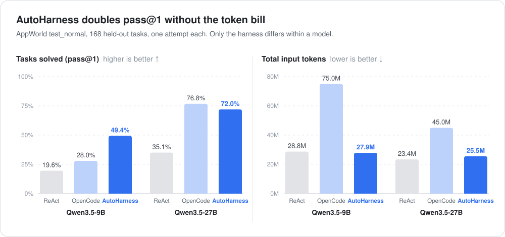
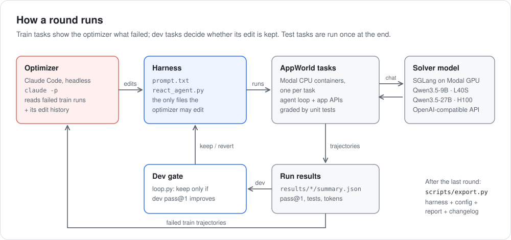
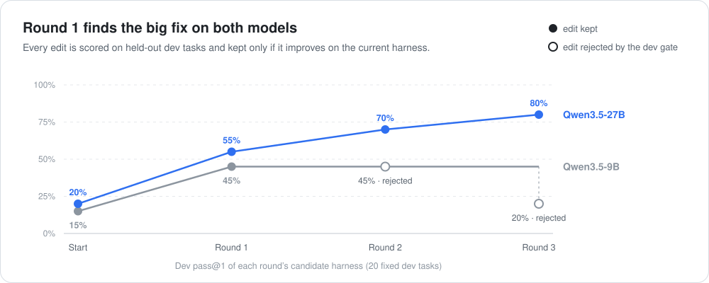

<p align="center">
  
</p>

<h1 align="center">AutoHarness</h1>

<p align="center">
  <b>Automatically designing task-specific harnesses that rival frontier general-purpose harnesses.</b>
</p>

<p align="center">
  <a href="LICENSE"></a>
  
  <a href="https://appworld.dev"></a>
  <a href="https://modal.com"></a>
  <a href="https://huyxdang.com/autoharness"></a>
</p>

Give AutoHarness a model and a task with a grader. It reads the model's failures, rewrites the
harness around it (the prompt and the agent loop), and keeps only the changes that hold up on tasks
it never studied. No weights change.

Adaption Labs [showed](https://adaptionlabs.ai/blog/a-better-harness-can-unlock-smaller-models) that
fixing a harness by hand can take a 27B open model from 67% to 86% on a legal agent benchmark.
AutoHarness automates that loop and tests it on a public benchmark: on AppWorld's held-out test
split it takes **Qwen3.5-9B from 19.6% to 49.4%** and **Qwen3.5-27B from 35.1% to 72.0%**.

## Results

<p align="center">
  
</p>

AppWorld's `test_normal` split, 168 held-out tasks, one attempt each (pass@1). Within a model, only
the harness changes.

| Model | Harness | pass@1 | Scenarios fully solved | Unit tests passed | Input tokens / task |
|---|---|---|---|---|---|
| Qwen3.5-9B | AppWorld ReAct (baseline) | 19.6% (33/168) | 7.1% | 67.4% | 171k |
| | OpenCode (frontier general-purpose) | 28.0% (47/168) | 8.9% | 61.9% | 446k |
| | **AutoHarness** | **49.4% (83/168)** | **25.0%** | **75.2%** | **166k** |
| Qwen3.5-27B | AppWorld ReAct (baseline) | 35.1% (59/168) | 26.8% | 80.4% | 139k |
| | OpenCode (frontier general-purpose) | **76.8% (129/168)** | **62.5%** | **89.0%** | 268k |
| | **AutoHarness** | 72.0% (121/168) | 55.4% | 87.3% | **152k** |

- **Against the baseline, the gains are large and significant.** +29.8 points on 9B (58 tasks solved
  only with AutoHarness vs. 8 only with ReAct, exact McNemar p ≈ 2×10⁻¹⁰) and +36.9 on 27B (70 vs. 8,
  p ≈ 2×10⁻¹³, 95% CI +28.0 to +45.8).
- **Against OpenCode, AutoHarness wins on 9B and ties on 27B, with far fewer tokens.** On 9B it is
  +21.4 points (50 vs. 14, p ≈ 7×10⁻⁶). On 27B OpenCode is 4.8 points ahead, within noise (26 vs. 18,
  p = 0.29, 95% CI −12.5 to +3.0). Across all 168 tasks AutoHarness reads 63% fewer input tokens
  than OpenCode on 9B (27.9M vs. 75.0M) and 43% fewer on 27B (25.5M vs. 45.0M).
- **The harness mattered more than model size.** Going from 9B to 27B under the same ReAct harness
  adds 15.5 points; changing the harness adds 29.8 (9B) and 36.9 (27B). 9B + AutoHarness beats
  27B + ReAct, 49.4% vs. 35.1% (p = 0.0015).

Reproduce any comparison with `python scripts/compare.py <run A> <run B>` (McNemar, bootstrap CIs over
tasks and over scenarios, answer-only breakdown). [`results/README.md`](results/README.md) maps every
number above to its run.

<details>
<summary><b>More statistics:</b> what the gain is made of, and leaderboard context</summary>

- **Most of the gain is one rule.** Most gained tasks are ones where ReAct did every action right, then
  gave an answer on a task that expects none (36 of 58 gains on 9B, 52 of 70 on 27B). That rule is part
  of the task spec, so these are real failures, but it is one fix. Counting only the other gains against
  ReAct's wins: 9B 22 vs. 8 (p = 0.016), 27B 18 vs. 8 (p = 0.08, not significant).
- **Why OpenCode falls behind on 9B but not on 27B:** 29 of OpenCode's 121 failures on 9B are that same
  mistake. OpenCode's prompt has the rule in its original one-line form, and the 9B model does not follow
  it reliably; the 27B model does (1 of its 39 failures). OpenCode also sends ~11k tokens of system
  prompt and tool schemas with every request vs. ~3.6k for AutoHarness.
- On scenarios fully solved (all 3 variants of a task), 9B + AutoHarness and 27B + ReAct are level
  (25.0% vs. 26.8%). With both optimized, size still counts: 72.0% vs. 49.4% (p ≈ 6×10⁻⁶).
- For context, the public [AppWorld leaderboard](https://appworld.dev/appworld/leaderboard) lists
  GPT-4o + ReAct at 48.8% and Llama3-70B + ReAct at 20.8% on the same split (2024 entries, so not
  identical conditions).

</details>

<details>
<summary><b>How OpenCode was run</b> (and what an audit of the first 9B run changed)</summary>

[OpenCode](https://github.com/anomalyco/opencode) 1.18.33, with its own agent loop, planning, and context
compaction as shipped. The adapter (`scripts/external_eval.py`) only decides how OpenCode reaches AppWorld:

- **API access:** AppWorld's MCP server exposes each API as a tool, but every task allows all 9 apps
  (~450 APIs, ~84k tokens of tool schemas), too many for any small-context model. AppWorld's API
  predictor (same model, AppWorld's prompt and 3 train-split examples) picks up to 20 APIs, which
  OpenCode gets as direct tools. On top of that, a proxy (`scripts/mcp_filter_proxy.py`) gives it
  `api_docs__show_api_descriptions`, `api_docs__show_api_doc`, and `call_api`, so it can look up and
  call **any** API on demand, like ReAct and AutoHarness do through `apis.api_docs` in code.
- **Prompt:** AppWorld's official function-calling instructions, with the same task-completion rules
  the ReAct baseline gets. Its worked example is not included (it is written as Python code for ReAct).
- **Sampling:** temperature 0, replies capped at 1,500 tokens, as for the other harnesses.
- **Context:** 64k (vs. 32k for ReAct and AutoHarness), because OpenCode's own system prompt and tool
  schemas take ~11k tokens per request. In the first 9B run, 23 tasks sent a request over 32k and
  OpenCode solved 1 of them, so the extra room did not decide the comparison.
- **Safety:** it runs on the local machine, so OpenCode's shell, file-editing, web, and filesystem
  tools are off. A 20-minute wall-clock cap per task applied.

**First 9B run, before the audit:** 22.6% (38/168). An audit found two adapter problems, not OpenCode
problems: (1) with only the predicted APIs, half the tasks were missing an API they needed (162 attempts
to call unavailable tools); (2) OpenCode's read-only file tools were still on, and in 21 tasks the model
searched the *host's* files for AppWorld's file-system app, solving none of them. Fixing both (and
pinning temperature 0) moved OpenCode from 22.6% to 28.0%. Tool-call parsing, the task clock, and
grading were checked and were correct. The 27B run used the fixed adapter from the start; it was run
in three parts because of GPU budget and merged with `scripts/merge_summaries.py`.

</details>

## How it works

<p align="center">
  
</p>

1. **Train data.** The model attempts a fresh batch of 15 training tasks with the current harness, and
   every trajectory is recorded.
2. **Optimizer LLM.** Claude (headless Claude Code, `claude -p`) reads the failed trajectories and its
   run's edit history, looks for mistakes that repeat across tasks, and edits the harness. It has no
   shell or web access and may only write inside that model's harness folder.
3. **Evaluator.** The edited harness runs on a fixed set of 20 dev tasks. It replaces the current
   harness only if dev pass@1 goes up (ties broken by unit tests passed) and input tokens rise by at
   most 20%. The loop runs 3 rounds.
4. **Evaluation.** The best harness runs once on the 168 test tasks, next to the original harness with
   the same model and settings.
5. **Output.** `scripts/export.py` packages the optimized harness with its config, a report, and a changelog.

<p align="center">
  
</p>

### What the loop tried

<p align="center">
  
</p>

Both runs found the same top fix on their own in round 1: on action tasks ("send…", "pay…"), the
model did every step right and then reported back what it did (`"Done"`, `"Money sent back to
Robert"`), while the grader expects no answer. The 9B optimizer rewrote the task-completion rules:

```diff
-- If an answer is needed, e.g., for "How many songs are in the Spotify queue?", call it with the appropriate answer argument value.
-- If no answer is required, e.g., for "Start my Spotify music player.", omit the answer argument (or set it to None/null).
+1. INFORMATION-SEEKING task — it asks you to find out or report something ("How many...", "What is...", "List..."). These expect an answer.
+2. ACTION task — it asks you to DO something (send, pay, delete, follow, create, ...). These expect NO answer.
+   Call `apis.supervisor.complete_task()` with no answer argument.
+   - Do NOT report back what you did here. Passing a confirmation, a summary, a status word, or a count
+     (e.g. "Done", "Sent", "15") will FAIL the task even when every action you performed was correct.
```

<details>
<summary><b>Every edit, round by round</b></summary>

**Qwen3.5-9B**

| Round | Edit proposed from train failures | Dev pass@1 | Verdict |
|---|---|---|---|
| 0 | AppWorld ReAct baseline | 15% | start |
| 1 | Don't return an answer on action tasks | **45%** | kept |
| 2 | Concrete recipe for fetching every page of API results | 45% (fewer unit tests passed) | rejected |
| 3 | Read API fields by exact name; sanity-check filters | 20% | rejected |

Round 3 looked sensible on its training failures but dropped dev accuracy from 45% to 20%; the dev gate
stopped it from shipping. A dev noise check (re-running both harnesses on the same 20 dev tasks) gave
ReAct 15% → 5% and AutoHarness 45% → 35%: single runs move by about ±2 tasks, and the ~30-point gap held.

**Qwen3.5-27B**

| Round | Edit proposed from train failures | Dev pass@1 | Verdict |
|---|---|---|---|
| 0 | AppWorld ReAct baseline | 20% | start |
| 1 | Answer only explicit questions; never a confirmation or summary | **55%** | kept |
| 2 | Loop guard in the agent code: warn on an identical repeated code block, stop after 3 repeats | 70% | kept (noise) |
| 3 | Always page through search/list results (APIs return 5 items per call by default) | 80% | kept (within noise) |

The 20-task dev set can't tell rounds 2 and 3 from noise. Round 2's guard never fired on any dev task,
yet 3 tasks flipped to passing: run-to-run variation, not the edit. The sequential loop has no noise
margin, so it kept both (the experimental `optimizer/loop_parallel.py` requires a 2-task margin and
re-scores the current best in the same batch). The 72.0% test score is for all three edits together;
the final dev score (80%) overstates it, as expected when keeping the best of noisy dev runs.

Full optimizer reasoning for each round: [`optimizer/history_9b.md`](optimizer/history_9b.md),
[`optimizer/history_27b.md`](optimizer/history_27b.md).

</details>

## What you get

`scripts/export.py` packages everything a user of the optimized harness needs into one folder per
model ([`export/appworld-qwen3.5-9b/`](export/appworld-qwen3.5-9b),
[`export/appworld-qwen3.5-27b/`](export/appworld-qwen3.5-27b)):

| File | What it's for |
|---|---|
| `harness/prompt.txt`, `harness/react_agent.py` | The optimized harness: a drop-in replacement for the agent you run today |
| `config.yaml` | The exact model and sampling settings it was validated with |
| `report.md` | Baseline vs. optimized on held-out tasks: accuracy, tokens, steps |
| `CHANGELOG.md` | Every edit that was tried, the failures behind it, and why it was kept or rejected |

## Reproduce

Requires Python 3.11, a [Modal](https://modal.com) account, and Claude Code.

```bash
# 1. AppWorld from source (the agents package needs it); then the data
git clone https://github.com/StonyBrookNLP/appworld && cd appworld
pip install -e . -e "experiments[simplified]" && appworld install --repo && appworld download data && cd ..

# 2. Model server (creates an OpenAI-compatible endpoint on Modal)
modal secret create autoharness-sglang SGLANG_API_KEY=<random-key>   # also put it in .env
SOLVER=qwen3.5-9b modal deploy serve/sglang_server.py

# 3. Optimize, then evaluate on test
python optimizer/loop.py --rounds 3 --model qwen3.5-9b --tag 9b_
bash scripts/final_eval.sh
python scripts/export.py --name appworld-qwen3.5-9b --baseline results/9b_test_react --optimized results/9b_test_auto

# Qwen3.5-27B on an H100: ReAct test, loop, and final test in one resumable script
SOLVER=qwen3.5-27b modal deploy serve/sglang_server.py
bash scripts/run_27b.sh
python scripts/compare.py 27b_test_react 27b_test_auto

# Redraw the README charts from results/
python scripts/figures.py
```

Setup notes that cost time (AppWorld's Git LFS quota, SGLang vs. AppWorld response format, runaway
generations, AppWorld's frozen clock stalling Modal's container heartbeat) are in
[`docs/notes.md`](docs/notes.md).

<details>
<summary><b>Repo layout</b></summary>

```
serve/sglang_server.py      SGLang on Modal (one app per solver model, API-key protected)
scripts/run_eval.py         run an agent on tasks → pass@1, unit tests, tokens, steps, time
scripts/modal_eval.py       run each AppWorld task in its own Modal CPU container
scripts/final_eval.sh       dev noise check + test_normal comparison (9B)
scripts/run_27b.sh          the 27B experiment end to end: ReAct test, loop, final test (resumable)
scripts/external_eval.py    run an external harness (OpenCode) on AppWorld tasks, graded the same way
scripts/mcp_filter_proxy.py MCP proxy: predicted APIs as tools + on-demand api_docs / call_api
scripts/merge_summaries.py  combine partial runs of one experiment into one summary
scripts/compare.py          paired comparison of two runs: McNemar, bootstrap CIs, answer-only breakdown
scripts/export.py           package the optimized harness + report + change log
scripts/figures.py          draw the README charts (assets/*.svg) from results/
harness/                    the harness package the runner loads; holds the optimized 9B harness
harnesses/27b/              the 27B harness (its own copy, started from AppWorld's ReAct agent)
optimizer/round.py          one round: train run → claude -p edits the harness → commit
optimizer/loop.py           rounds with automatic keep/reject on dev (used for all reported runs)
optimizer/candidates.py     experimental parallel variant: one diagnosis call, k editors, k candidates
optimizer/loop_parallel.py  experimental: scores current best + k candidates together, keeps a winner by a margin
optimizer/history_*.md      every edit and its verdict, one file per run (9b, 27b)
results/                    summary.json for every run (index: results/README.md)
export/                     the packaged harnesses
docs/notes.md               working notes: plan, decisions, setup gotchas
```

</details>

## Limitations

- **One benchmark, one model family.** AppWorld and two Qwen3.5 models, 3 optimization rounds each.
  Both times the big win was one fix found in round 1; later rounds added nothing the dev set could
  measure, so it is not yet shown that gains keep compounding.
- **A small, noisy dev set.** 20 tasks, so each is worth 5 points and single runs move by about ±2–3
  tasks. The sequential loop has no noise margin: in the 27B run it kept an edit that never fired on
  dev. The test split (168 tasks) is the number to trust.
- **One test run per harness.** Sampling is temperature 0, but batched inference is not perfectly
  deterministic. Time per task is not compared for 27B, since its test runs ran under different GPU load.
- **Our OpenCode adapter.** API access goes through AppWorld's predictor plus on-demand lookup, and its
  prompt lacks the worked example the ReAct-style harnesses get; a different adapter could score
  differently. Prime Agent was not compared: its Python REPL runs unsandboxed on the host.
- **Prompt and agent loop only.** Tool wrappers, memory, and context compaction are not yet in the
  search space (two dev tasks still overflowed the 32k context).
- **Unknown trade-offs across tasks.** A harness specialized for one task distribution may do worse
  on unrelated tasks; that has not been tested.

## Where this goes

The product version starts from a user's task description and a few examples instead of a public
benchmark: generate a preview set of tasks and graders, have the user approve it, generate the full
train/dev/test benchmark, then run this loop and return the export. The full write-up, including the
path to adoption, is at [huyxdang.com/autoharness](https://huyxdang.com/autoharness).

## License

[MIT](LICENSE)
