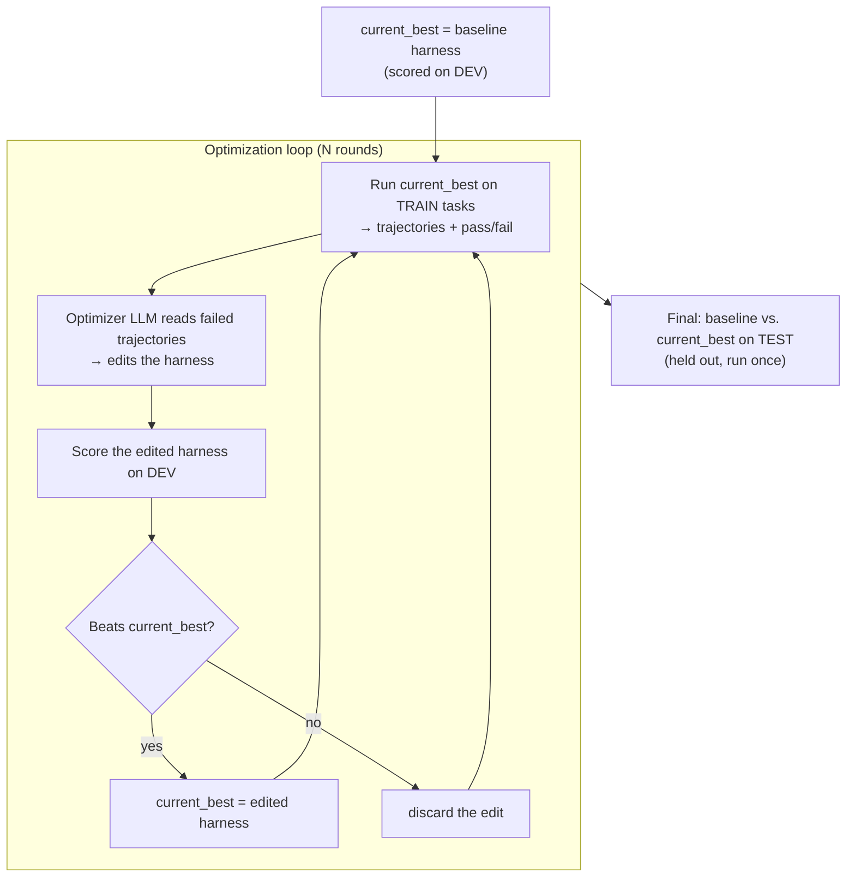

# AutoHarness

**Automatic harness optimization for small open models.** Give it a model and a task with a
grader; it reads the model's failures, rewrites the harness around the model (prompt and agent
loop), and keeps only the changes that hold up on tasks it never studied.

Adaption Labs showed that a better harness can take a 27B open model from 67% to 86% on a legal
agent benchmark with no weight changes, from harness fixes found by hand
([post](https://adaptionlabs.ai/blog/a-better-harness-can-unlock-smaller-models)).
AutoHarness automates that loop and tests it on a public benchmark.

## Result

On AppWorld's held-out `test_normal` split (168 tasks, one attempt each), with **Qwen3.5-9B**:

| Harness | pass@1 | Unit tests passed | Input tokens / task | Steps / task |
|---|---|---|---|---|
| AppWorld ReAct (baseline) | 19.6% (33/168) | 67.4% | 171k | 19.2 |
| **AutoHarness** | **49.4% (83/168)** | 75.2% | 166k | 18.5 |

- Same model, same sampling settings, same tasks; only the harness differs.
- Task by task: 58 solved only by AutoHarness, 8 only by the baseline (exact McNemar test, p ≈ 2×10⁻¹⁰).
- No extra cost: input tokens per task went down 3%.
- For context, the public [AppWorld leaderboard](https://appworld.dev/appworld/leaderboard) lists
  GPT-4o + ReAct at 48.8% and Llama3-70B + ReAct at 20.8% on the same split (2024 entries, so not
  identical conditions).

The winning change was found automatically from training-set failures. The optimizer noticed that
11 of 14 failed tasks were *action* tasks ("send…", "delete…") where the model reported back what it
did (`"Done"`, `"15"`), while the grader expects no answer. It rewrote the task-completion section
of the prompt:

```diff
-- If an answer is needed, e.g., for "How many songs are in the Spotify queue?", call it with the appropriate answer argument value.
-- If no answer is required, e.g., for "Start my Spotify music player.", omit the answer argument (or set it to None/null).
+1. INFORMATION-SEEKING task — it asks you to find out or report something ("How many...", "What is...", "List..."). These expect an answer.
+2. ACTION task — it asks you to DO something (send, pay, delete, follow, create, ...). These expect NO answer.
+   Call `apis.supervisor.complete_task()` with no answer argument.
+   - Do NOT report back what you did here. Passing a confirmation, a summary, a status word, or a count
+     (e.g. "Done", "Sent", "15") will FAIL the task even when every action you performed was correct.
```

## How it works



- **Solver:** Qwen3.5-9B, served with SGLang on one Modal L40S (thinking disabled).
- **Optimizer:** Claude Opus 4.8 via headless Claude Code (`claude -p`). It sees only failed *train*
  trajectories and `optimizer/history.md` (earlier edits and their verdicts), and may edit only `harness/`.
- **Keep rule:** dev pass@1 must go up (ties broken by unit-test pass rate), and input tokens may rise at most 20%.
- **Splits:** train (fresh 15 tasks per round) → dev (fixed 20 tasks) → test (168 tasks, touched once).

### What the loop tried

| Round | Edit proposed from train failures | Dev pass@1 | Verdict |
|---|---|---|---|
| 0 | AppWorld ReAct baseline | 15% | start |
| 1 | Don't return an answer on action tasks | **45%** | kept |
| 2 | Concrete recipe for fetching every page of API results | 45% (fewer unit tests passed) | rejected |
| 3 | Read API fields by exact name; sanity-check filters | 20% | rejected |

Round 3 looked sensible on its training failures but dropped dev accuracy from 45% to 20%. The dev
gate is what stopped it from shipping.

Dev noise check: re-running both harnesses on the same 20 dev tasks gave ReAct 15% → 5% and
AutoHarness 45% → 35%. Single runs move by about ±2 tasks; the ~30-point gap held.

## What you get: the export

`scripts/export.py` packages everything a user of the optimized harness needs into one folder
([`export/appworld-qwen3.5-9b/`](export/appworld-qwen3.5-9b)):

| File | What it's for |
|---|---|
| `harness/prompt.txt`, `harness/react_agent.py` | The optimized harness: drop-in replacement for the agent you run today |
| `config.yaml` | The exact model and sampling settings it was validated with |
| `report.md` | Baseline vs. optimized on held-out tasks: accuracy, tokens, steps |
| `CHANGELOG.md` | Every edit that was tried, the failures behind it, and why it was kept or rejected |

The benchmark splits and grader double as a regression test when the model changes, and the
failures the harness could not fix are the natural targets for post-training.

## Repo layout

```
serve/sglang_server.py      SGLang on Modal (one app per solver model, API-key protected)
scripts/run_eval.py         run an agent on tasks → pass@1, unit tests, tokens, steps, time
scripts/modal_eval.py       run each AppWorld task in its own Modal CPU container
scripts/final_eval.sh       dev noise check + test_normal comparison
scripts/export.py           package the optimized harness + report + change log
harness/                    the harness being optimized (the only thing the optimizer may edit)
optimizer/round.py          one round: train run → claude -p edits harness/ → commit
optimizer/loop.py           rounds with automatic keep/reject on dev
optimizer/candidates.py     parallel version: one diagnosis call, k editors, k candidates
optimizer/loop_parallel.py  scores current best + k candidates together, keeps winner by a margin
optimizer/history.md        every edit and its verdict
results/                    summary.json for every run
```

## Reproduce

Requires Python 3.11, a [Modal](https://modal.com) account, and Claude Code.

```bash
# 1. AppWorld from source (the agents package needs it); then the data
git clone https://github.com/StonyBrookNLP/appworld && cd appworld
pip install -e . -e "experiments[simplified]" && appworld install --repo && appworld download data && cd ..

# 2. Model server (creates an OpenAI-compatible endpoint on Modal)
modal secret create autoharness-sglang SGLANG_API_KEY=<random-key>   # also put it in .env
SOLVER=qwen3.5-9b modal deploy serve/sglang_server.py

# 3. Optimize, then evaluate on test
python optimizer/loop.py --rounds 3 --model qwen3.5-9b --tag 9b_
bash scripts/final_eval.sh
python scripts/export.py --name appworld-qwen3.5-9b --baseline results/9b_test_react --optimized results/9b_test_auto
```

Setup notes that cost time (AppWorld's Git LFS quota, SGLang vs. AppWorld response format,
runaway generations) are in [PLAN.md](PLAN.md).

## Limitations

- One benchmark (AppWorld), one solver (Qwen3.5-9B), 3 optimization rounds, and one kept edit.
  The loop found one big win; more rounds have not yet shown whether gains keep compounding.
- The dev set has 20 tasks, so each is worth 5 points and single runs move by about ±2 tasks. The
  test split (168 tasks) is the number to trust.
- Test results are one run per harness. Sampling is temperature 0, but batched inference is not
  perfectly deterministic.
- Leaderboard comparisons are context only: those entries used AppWorld's 2024 setup.
- The harness is prompt + agent loop only. Tool wrappers, memory, and context compaction are not
  yet in the search space (two dev tasks still overflowed the 32k context).

## Where this goes

The product version starts from a customer's task description and a few examples instead of a
public benchmark: generate a preview set of tasks with graders, have the customer approve it,
generate the full train/dev/test benchmark (for example with Adaption's Adaptive Data), then run
this loop and return the export. The failures the harness can't fix become the data for
post-training.
